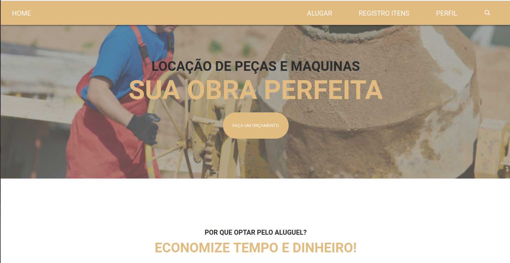
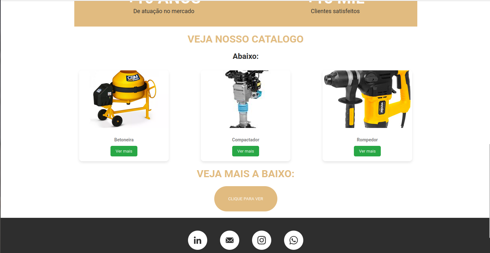
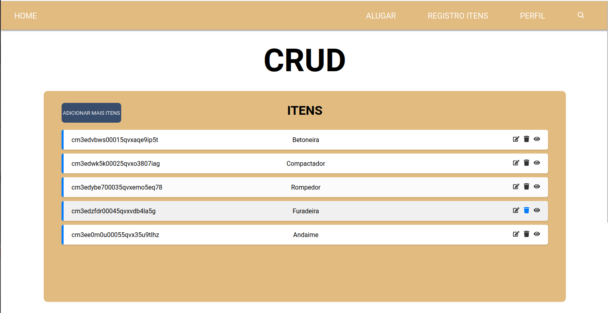
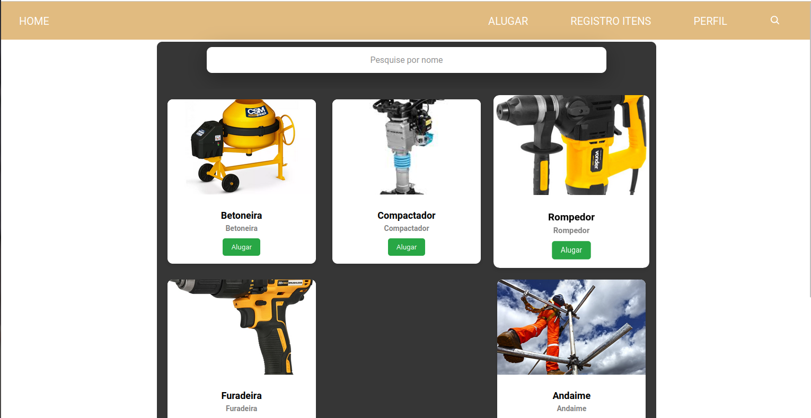
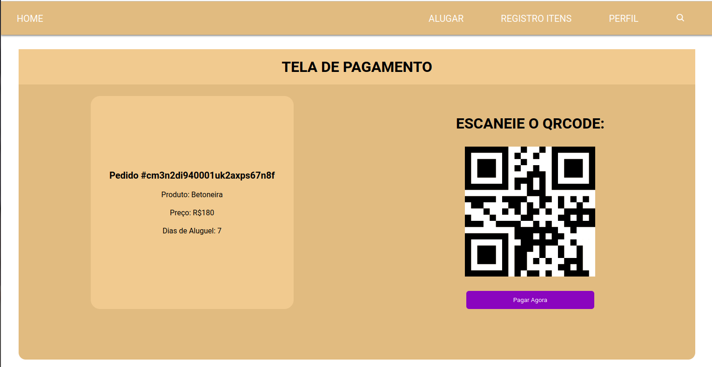
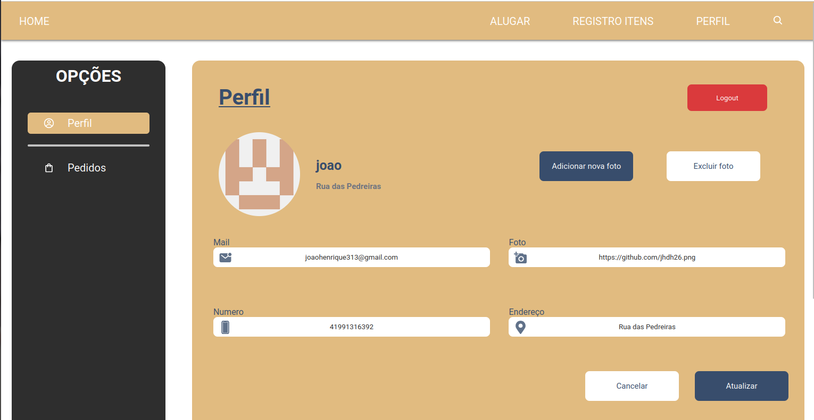
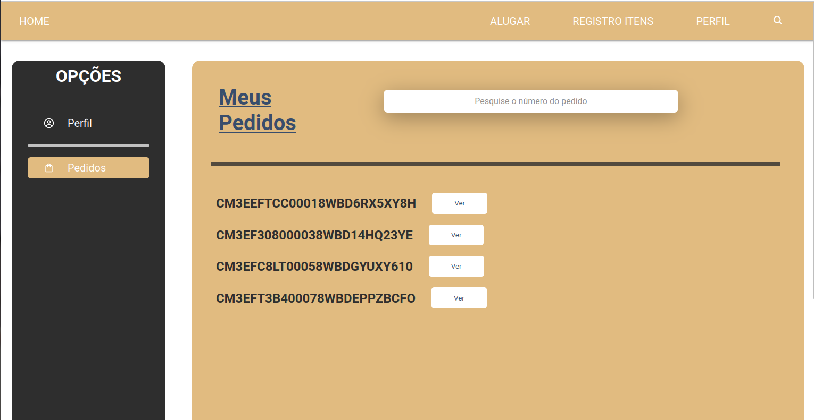

# PROJETO CRIADO EM REACT.js e NODE.js

## Execução:

npm i (na pasta backend e frontend)

BACK END:

node server.js

FRONT END:

npm run dev

## Sobre:

PeçaCerta é um projeto academico realizado para demonstrar conhecimentos sobre a implementação de um sistema FULLSTACK que utilize uma API.

## Funcionalidades

No projeto, foi desenvolvido o sistema de login utilizando **JSONWEBTOKEN** e **BCRYPT**, onde se utiliza para garantir que o usuario fique LOGADO no site e de acesso a todas as paginas protegidas pelo **MIDDLEWARE**.

Crud 100% funcional com funções de **ADICIONAR,EDITAR E EXCLUIR** os produtos.

Sistema de aluguel com reconhecimento do produto pelo seu **ID**, e ao clicar em alugar será feito a diminuição da quantidade do produto automaticamente.

Pagina de **PERFIL DO USUARIO** com perfil personalizado, botão para **LOGOUT**, atualização e remoção de foto de perfil e pagina de **PEDIDOS**.

